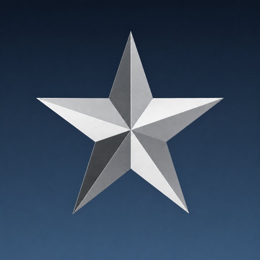

<div align="center">

# coduo_lnxded-AppImage 🐧

[](https://github.com/Nemo-010/coduo_lnxded-AppImage/releases/latest)
[](https://github.com/Nemo-010/coduo_lnxded-AppImage/releases/latest)
[](https://github.com/Nemo-010/coduo_lnxded-AppImage/releases/latest)

<p align="center">
  
</p>

| Latest Stable Release | Upstream URL |
| :---: | :---: |
| [Click here](https://github.com/Nemo-010/coduo_lnxded-AppImage/releases/latest) | [Click here](https://github.com/opencoduo/coduomp) |

</div>

---

Unofficial AppImage of the [Open CoD:UO](https://github.com/opencoduo/coduomp) dedicated server for **Call of Duty: United Offensive**.

AppImage made using [quick-sharun](https://github.com/pkgforge-dev/Anylinux-AppImages/blob/main/useful-tools/quick-sharun.sh), which makes it extremely easy to turn any binary into a portable package reliably without using containers or similar tricks.

**This AppImage bundles everything and it should work on any Linux distro, including old and musl-based ones.**

This AppImage doesn't require FUSE to run at all, thanks to the [uruntime](https://github.com/VHSgunzo/uruntime).

This AppImage is also supplied with a self-updater by default, so any updates to this application won't be missed, you will be prompted for permission to check for updates and if agreed you will then be notified when a new update is available.

Self-updater is disabled by default if AppImage managers like [am](https://github.com/ivan-hc/AM), [soar](https://github.com/pkgforge/soar) or [dbin](https://github.com/xplshn/dbin) exist, which manage AppImage updates.

## Retail game data is required

This AppImage contains the server binary and its game module only. **Call of Duty: United Offensive must already be installed**, because the server reads your existing game data in place and does not copy it.

On startup the server looks for a retail root containing both `main/pak0.pk3` and `uo/pakuo00.pk3`:

1. the `CODUOMP_DATA_PATH` environment variable, if set;
2. the working directory, so running the AppImage from the game directory works;
3. a previously saved path;
4. Steam app **2640**, across all configured Steam libraries.

If nothing is found, set the path explicitly:

```sh
CODUOMP_DATA_PATH="$HOME/.steam/steam/steamapps/common/Call of Duty United Offensive" \
  ./coduo_lnxded-x86_64.AppImage +set dedicated 2 +exec server.cfg
```

You can also write it once into `~/.config/coduo_lnxded/data-path`.

`CODUOMP_DATA_PATH` is the same variable the client AppImage uses, since it is the same game data.

Server configuration, logs and screenshots live in `~/.callofduty`, never inside the AppImage.

---

More at: [AnyLinux-AppImages](https://pkgforge-dev.github.io/Anylinux-AppImages/)
